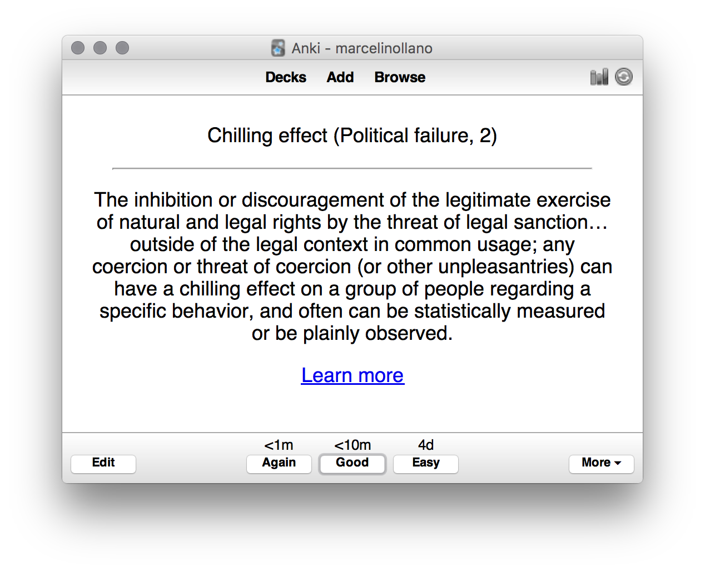

# Mental models

I read ["Mental models i find repeatedly useful"](https://medium.com/@yegg/mental-models-i-find-repeatedly-useful-936f1cc405d#.ngjmxnx5x) by the great [Gabriel Weinberg](https://twitter.com/yegg) from [DuckDuckGo](https://duckduckgo.com) and loved it. 
Wouldn't be pretty cool to memorize the list yourself? 

It seemed like a great idea but reading the post over and over again was a bit boring. I really like using [Anki](http://ankisrs.net) (please update that icon!) to memorise things and I though I could turn the post into a deck. [Using this custom Markdown format](https://gist.github.com/marcelinollano/de710e3d3665162ac752) I created a deck that you can use with Anki.

In the Anki window you can see the category and the frequency number, just like the post explains:

> The numbers next to each mental model reflect the frequency with which they come up: 

> (1) — Frequently (62 models)  
> (2) — Occasionally (40 models)  
> (3) — Rarely, though still repeatedly (84 models)

## How to install

1. Download, install and open [Anki](http://ankisrs.net/#download)
2. [Download the deck](https://github.com/marcelinollano/mental-models/blob/master/mental-models.apkg?raw=true)
3. Double-click the deck and the mental models deck should be there

## Credits

All credit goes to [Gabriel Weinberg](https://twitter.com/yegg) and his great post. I am not affiliated in any way with [Anki](http://ankisrs.net), I just like using it and I recommend it. Feed your brain!
